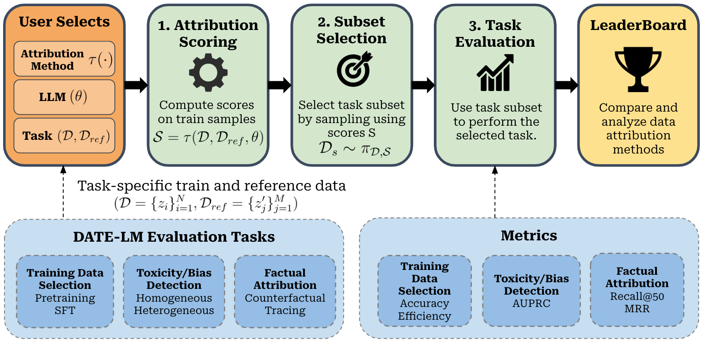

#   DATE-LM: Data Attribution Evaluation Benchmark

[](https://huggingface.co/DataAttributionEval)


**DATE-LM** is a benchmark suite designed for evaluating data attribution methods on real-world applications for large language models (LLMs), created by researchers from Carnegie Mellon University, University of Illinois at Urbana-champaign, and University of Michigan.
- 📄 [DATE-LM Paper](https://arxiv.org/abs/2507.09424)
- 🏆 [DATE-LM Leaderboard](https://huggingface.co/spaces/DataAttributionEval/DATE-LM-Leaderboard)

## Quick Links

- [1. Overview](#1-overview)
- [2. Environment Setup](#2-environment-setup)
- [3. Evaluation workflow](#3-evaluation-workflow)
  - [Pre-train Data Selection](pretrain_data_selection.md)
  - [Fine-tuning](finetune_data_selection.md)
  - [Toxicity/Bias Filtering](Applications.md)
  - [Factual Attribution](Applications.md)
- [4. Leaderboard](#4-leaderboard)

## 1. Overview



Our evaluation framework contains:
- 🧩 Modular pipeline supporting attribution scoring, subset selection, and task evaluation
- 🔌 Plug-and-play support for new attribution methods
- 📈 Pre-trained and fine-tuned model checkpoints for reproducibility and efficiency
- 🏆 Public leaderboard for standardized benchmarking and community engagement

We support **three core evaluation tasks**:
- Training Data Selection: pre-training and SFT
- Toxicity/Bias Filtering
- Factual Attribution

---

## 2. Environment Setup

Install the required dependencies using the files `env.yml` and `requirements.txt`:

```bash
conda env create --file env.yml --name myenv
conda activate myenv
pip install -r requirements.txt
```

## 3. Evaluation workflow
The evaluation process consists of the following steps:

1. **Download Datasets and Models**: Choose a task and follow the preparation steps to download datasets and models.  

2. **Run Attribution Scoring**: Define a scoring function that takes a model checkpoint, a reference dataset, and a training dataset, and outputs an attribution score for each datapoint in the training dataset. 

3. **Run Task-Specific Evaluation**: Execute the evaluation pipeline for the selected task.

Detailed steps and tutorials are available in the following documentation files:

- **[Pre-train Data Selection](pretrain_data_selection.md)**
- **[Fine-tuning](finetune_data_selection.md)**
- **[Toxicity/Bias Filtering](Applications.md)**
- **[Factual Attribution](Applications.md)**

## 4. Leaderboard
Please see the link below for instructions to submit to the leaderboard: 
https://huggingface.co/spaces/DataAttributionEval/DATE-LM-Leaderboard

## Citation
Please use this citation to reference our work

```
@inproceedings{2025datelm,
  title={DATE-LM: Benchmarking Data Attribution Evaluation for Large Language Models}, 
  author={Cathy Jiao and Yijun Pan and Emily Xiao and Daisy Sheng and Niket Jain and Hanzhang Zhao and Ishita Dasgupta and Jiaqi W. Ma and Chenyan Xiong},
  year={2025},
  booktitle={NeurIPS},
  url={https://arxiv.org/abs/2507.09424}, 
}
```

## Acknowledgements
This repository includes components from the following projects:
```
@inproceedings{NEURIPS2024_f7326833,
    author    = {Deng, Junwei and Li, Ting-Wei and Zhang, Shiyuan and Liu, Shixuan and Pan, Yijun and Huang, Hao and Wang, Xinhe and Hu, Pingbang and Zhang, Xingjian and Ma, Jiaqi},
    booktitle = {Advances in Neural Information Processing Systems},
    editor    = {A. Globerson and L. Mackey and D. Belgrave and A. Fan and U. Paquet and J. Tomczak and C. Zhang},
    pages     = {136763--136781},
    publisher = {Curran Associates, Inc.},
    title     = {\textbackslash texttt\lbrace dattri\rbrace : A Library for Efficient Data Attribution},
    url       = {https://proceedings.neurips.cc/paper_files/paper/2024/file/f732683302d91e47610b2416b4977a66-Paper-Datasets_and_Benchmarks_Track.pdf},
    volume    = {37},
    year      = {2024}
}

@misc{ivisondata2025,
  title={{Large-Scale Data Selection for Instruction Tuning}},
  author={Hamish Ivison and Muru Zhang and Faeze Brahman and Pang Wei Koh and Pradeep Dasigi},
  year={2025},
  eprint={2503.01807},
  archivePrefix={arXiv},
  primaryClass={cs.CL},
  url={https://arxiv.org/abs/2503.01807},
 }

@inproceedings{yu2024mates,
   title={MATES: Model-Aware Data Selection for Efficient Pretraining with Data Influence Models},
   author={Yu, Zichun and Das, Spandan and Xiong, Chenyan},
   booktitle={NeurIPS},
   year={2024}
}
```
