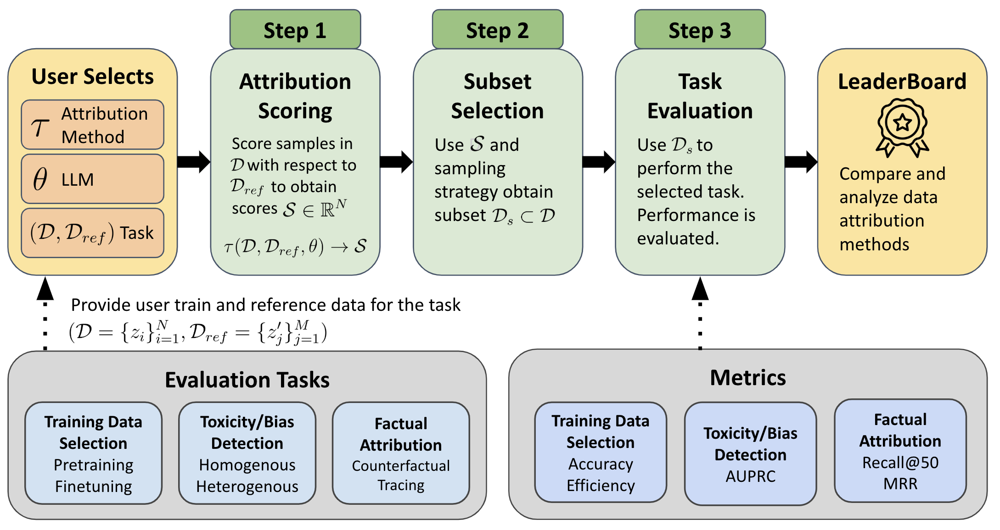

#   DATE-LM: Data Attribution Evaluation Benchmark
**DATE-LM** is a benchmark suite designed for evaluating data attribution methods in real-world applications of large language models (LLMs).


[](https://huggingface.co/DataAttributionEval)




## Key Features

- **Three Core Evaluation Tasks**:
  - Training Data Selection (pre-training and fine-tuning)
  - Toxicity/Bias Filtering
  - Factual Attribution
- Modular pipeline supporting attribution scoring, subset selection, and task evaluation
- Plug-and-play support for new attribution methods
- Pre-trained and fine-tuned model checkpoints for reproducibility and efficiency
- Public leaderboard for standardized benchmarking and community engagement

---

## Environment Setup

Install the required dependencies using the files `env.yml` and `requirements.txt`:

```bash
conda env create --file env.yml --name myenv
conda activate myenv
pip install -r requirements.txt
```

## Evaluation workflow
The evaluation process consists of the following steps:

1. **Download Datasets and Models**: Choose a task and follow the preparation steps to download datasets and models.  

2. **Run Attribution Scoring**: Define a scoring function that takes a model checkpoint, a reference dataset, and a training dataset, and outputs an attribution score for each datapoint in the training dataset. 

3. **Run Task-Specific Evaluation**: Execute the evaluation pipeline for the selected task.

Detailed steps and tutorials are available in the following documentation files:

- **[Pre-train Data Selection](pretrain_data_selection.md)**
- **[Fine-tuning](finetune_data_selection.md)**
- **[Toxicity/Bias Filtering](Applications.md)**
- **[Factual Attribution](Applications.md)**


## Leaderboard
how to submit to leaderboard: 
https://huggingface.co/spaces/DataAttributionEval/DATE-LM-Leaderboard

## Citation

## Acknowledgements
This repository includes components from the following projects:
```
@inproceedings{NEURIPS2024_f7326833,
    author    = {Deng, Junwei and Li, Ting-Wei and Zhang, Shiyuan and Liu, Shixuan and Pan, Yijun and Huang, Hao and Wang, Xinhe and Hu, Pingbang and Zhang, Xingjian and Ma, Jiaqi},
    booktitle = {Advances in Neural Information Processing Systems},
    editor    = {A. Globerson and L. Mackey and D. Belgrave and A. Fan and U. Paquet and J. Tomczak and C. Zhang},
    pages     = {136763--136781},
    publisher = {Curran Associates, Inc.},
    title     = {\textbackslash texttt\lbrace dattri\rbrace : A Library for Efficient Data Attribution},
    url       = {https://proceedings.neurips.cc/paper_files/paper/2024/file/f732683302d91e47610b2416b4977a66-Paper-Datasets_and_Benchmarks_Track.pdf},
    volume    = {37},
    year      = {2024}
}

@misc{ivisondata2025,
  title={{Large-Scale Data Selection for Instruction Tuning}},
  author={Hamish Ivison and Muru Zhang and Faeze Brahman and Pang Wei Koh and Pradeep Dasigi},
  year={2025},
  eprint={2503.01807},
  archivePrefix={arXiv},
  primaryClass={cs.CL},
  url={https://arxiv.org/abs/2503.01807},
 }

@inproceedings{yu2024mates,
   title={MATES: Model-Aware Data Selection for Efficient Pretraining with Data Influence Models},
   author={Yu, Zichun and Das, Spandan and Xiong, Chenyan},
   booktitle={NeurIPS},
   year={2024}
}
```